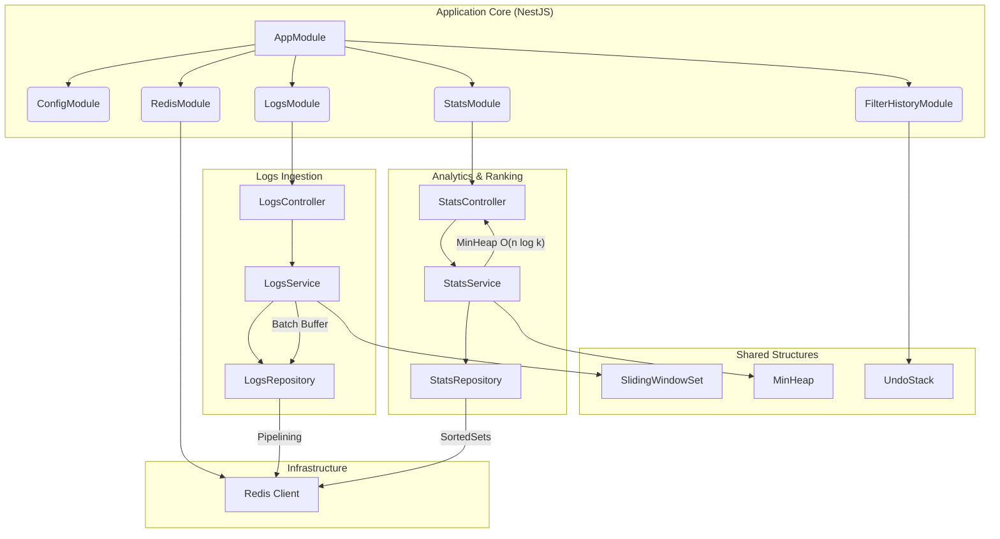

# 🚀 Log-Stream Analyzer API

High-performance, real-time log processor built with **NestJS 11**, **Node.js 22**, and **Redis**.

## 🐳 Quick Start with Docker

The easiest way to run the full stack (API + Redis) is using Docker Compose.

```bash
docker compose up --build -d
```

- **API**: [http://localhost:3000](http://localhost:3000)
- **Interactive Documentation**: [http://localhost:3000/api/docs](http://localhost:3000/api/docs)

---

## 🛠️ Project Structure & Architecture



The project follows a modular NestJS architecture designed for high throughput:

- **`src/logs`**: Core ingestion engine. Handles single-entry POSTs and high-speed NDJSON streams using asynchronous batch buffers.
- **`src/stats`**: Analytical layer. Uses a **MinHeap** to identify top errors without sorting millions of records.
- **`src/filter-history`**: State management for user filters using a durable **UndoStack**.
- **`src/redis`**: Global configuration and connection management for the Redis client with integrated error handling.
- **`src/shared`**: 
  - **`data-structures`**: Custom implementations of `SlidingWindowSet`, `MinHeap`, and `UndoStack`.
  - **`middlewares`**: Request logging and performance monitoring.

---

## 🏗️ Data Structures Justification

The system uses three core data structures to guarantee constant-time processing at high volumes:

### 1. SlidingWindowSet — Duplicate Detection — O(1)
Used to detect and skip duplicate logs (sharing the same `id`) within a configurable time window (`DUPLICATE_WINDOW_MS`).
- **Why O(1)?**: It uses a standard `Set<string>` for hash-table lookups.
- **Memory Safety**: An internal `Queue` tracks the ingestion order. On every new entry, stale IDs (older than the window) are evicted from both the Queue and the Set, preventing memory leaks over time.
- **Durability**: The window state is periodically snapshotted to Redis, allowing the deduplication logic to survive container restarts.

### 2. MinHeap — Top-K Error Ranking — O(n log k)
To identify the top 10 error messages among millions of logs.
- **Why O(n log k)?**: Standard sorting takes **O(n log n)**. By maintaining a min-heap of size `k=10`, we only perform `n` heap operations (log k), which is independent of the total sample size `n`.
- **Latency**: Ranking is computed in RAM during result fetching, while counts are persisted in a Redis Sorted Set (`ZINCRBY`).

### 3. UndoStack — Filter History — O(1)
Manages the history of query filters applied by the user.
- **Efficiency**: Implemented as a bounded LIFO stack. Push, Pop, and Peek operations are all constant-time.
- **State Management**: The entire stack is snapshotted to Redis on every change, ensuring that if you restart the service, your filter history remains intact.


---

## 📈 Scaling to 100k Logs / Second

To handle extreme loads, the following architectural upgrades are recommended:

### 1. External Ingestion Buffer (Implemented)
- **Status**: ✅ **Implemented**.
- **Impact**: We use **Redis Pipelining** to group hundreds of Redis commands into a single network request (RTT). We also implemented **batching** (1,000 logs/batch) to avoid overwhelming the persistence layer.

### 2. Horizontal API Scaling
- **Strategy**: The API is **Stateless**. You can spin up 10–20 instances behind a load balancer (Nginx/HAProxy). 
- **Sticky sessions**: Not required, as all state (Deduplication, Stats, History) is shared via the Redis cluster.

### 3. Message Queuing (Kafka / Redis Streams)
- **Strategy**: Insert a message queue (Kafka or Redis Streams) between the API and the worker services. 
- **Impact**: This "shaves off" demand spikes. The API simply validates and produces messages to the queue, while multiple workers consume and persist them independently.

### 4. Redis Cluster & Sharding
- **Strategy**: Migrate from a single Redis instance to a **Redis Cluster**.
- **Impact**: Shard the `log:*` keyspace by `id` across multiple Redis nodes to distribute the write/read load horizontally.

### 5. Persistent Stream Handling
- **Status**: ✅ **Implemented**.
- **Impact**: Our stream endpoint already bypasses `body-parser`. For 100k/s, we can utilize **Zero-copy** mechanisms or move ingestion logic to the edge using a performant proxy (like Rust-based gateways).


---

## 📝 Generating Test Data

The project includes a high-performance script to generate massive NDJSON files for stress testing.

```bash
# Generates 100,000 unique logs in large-logs.ndjson
node scripts/generate-logs.js

# To ingest the generated file:
curl -X POST http://localhost:3000/logs/ingest/stream \
  -H "Content-Type: application/octet-stream" \
  --data-binary @large-logs.ndjson
```

---

## 🔧 Maintenance & Quality Control

### Running Tests
Ensure 100% coverage before any deployment:
```bash
npm run test:cov
```

### Linting & Formatting
The project enforces a complexity limit of **6** per function:
```bash
npm run lint
```

### Environment Synchronization
The app uses a strict "Fast-Fail" strategy. If your `.env` is invalid or `REDIS_URL` is unreachable, the API will not start, protecting against corrupted states.

---
**High-performance log analysis, simplified.**
